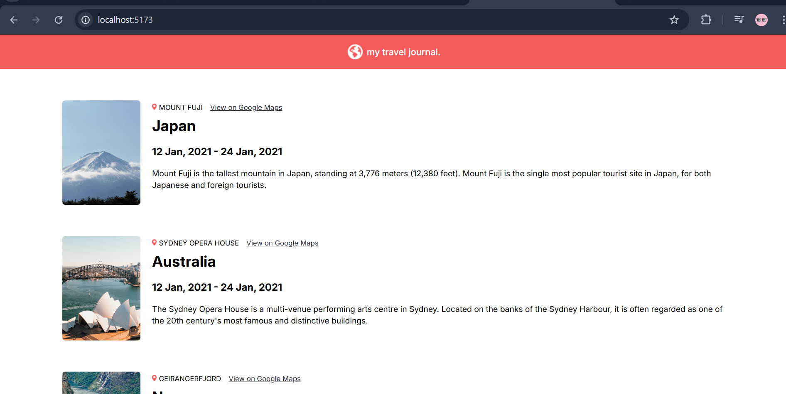

# 🌍 Travel Journal

This is a simple React project called **Travel Journal**. It showcases different travel destinations around the world in the form of journal entries, each with a photo, location, map link, and description.

## 📸 Preview



> A React-based UI featuring travel entries from Japan, Australia, and Norway.

## 🛠️ Tech Stack

- React (Vite)
- HTML5
- CSS3
- JavaScript (ES6+)

## 📁 Project Structure

src/
│
├── assets/
│ ├── globe.png
│ └── fill 219.png
│
├── Components/
│ ├── Entry.jsx
│ └── Header.jsx
│
├── data.js
└── App.jsx

## 📦 How to Run Locally

1. **Clone the repository**
   ````
   git clone https://github.com/marryamabid/travel-journal.git
   cd travel-journal
    ```
   Install dependencies
   ````

```
npm install
```

Run the project

```
npm run dev
```

Open in browser
Go to http://localhost:5173

📖 Features
Dynamic rendering of entries using .map()

Component-based architecture

Simple and clean UI

Google Maps link integration

📌 Future Improvements
Add more travel entries from a backend or API

Add routing for each destination

Include a dark mode toggle

🧑‍💻 Author
Marryam Abid

📝 License
This project is open source and free to use.
